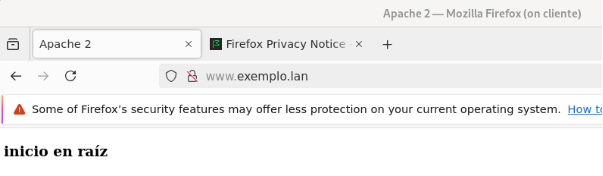
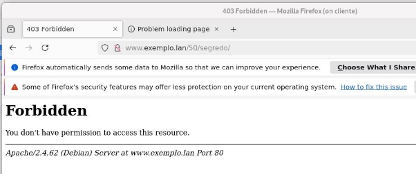

Configuramos un servidor virtual para[ www.exemplo.lan](http://www.exemplo.lan) (e que tamén responda para exemplo.lan e eq1.exemplo.lan). monta o directorio exemplo.lan en  en /opt/web/exemplo.lan 

Se empregas a máquina virtual de Google Cloud, elixe ti dous dos nomes que teñas ti configurado nun dos teus dominios. 

A configuración para o sitio[` `~~www.exemplo.lan~~](http://www.exemplo.lan) debe ser a seguinte: 

- O raíz de documentos debe ser /opt/web/exemplo.lan/htdocs. A orde de ficheiros de procura debe ser inicio.html, indice.html e primeiro.html por esta orde. Tendo en conta os ficheiros que hai no directorio raíz, indica que ficheiro se amosa accedendo a[ http://www.exemplo.lan/](http://www.exemplo.lan/),[ http://www.exemplo.lan/11](http://www.exemplo.lan/11) e[ http://www.exemplo.lan/22](http://www.exemplo.lan/22) explicándoo brevemente, e pegando unha captura de pantalla desde o navegador dun cliente. 

  

  

  Si se accede a la raíz se muestra inicio.html porque por el orden es el primero que se muestra, y al existir inicio ya no se muestran los otros. 

  

  Si se accede a la carpeta 11 se muestra índice.html que es el primero en mostrarse por el orden en DirectoryIndex. 

- No host virtual queremos facer que se habiliten as inclusións desde o servidor e se sigan as ligazóns simbólicas. Para probalo, crea unha ligazón simbólica chamado “zz” ao directorio 33 (ámbolos dous dentro do directorio raíz de documentos. Ademais, queremos facer que no directorio 33 a orde de ficheiros de atopar cando se introduce na URL o nome dun directorio, sexa indice.html, inicio.html e primeiro.html. Amosa a configuración establecida e indica razoadamente que ficheiro se debería amosar accedendo a[ http://www.exemplo.lan/zz](http://www.exemplo.lan/zz) e[ http://www.exemplo.lan/33](http://www.exemplo.lan/33). Amosa unha captura de pantalla de cada un para demostralo. 

Como corresponde por el DirectoryIndez cuando se accede a 33 se muestra índice.html por ser el primero que se busca. 

Dado que zz es un enlace simbólico (similar a un acceso directo de windows) el directorio zz muestra lo mismo que 33 (por ser eso un enlace) se le aplica lo mismo que si fuese el 33 porque lo es realmente. 

- No directório 33 (dentro do raíz de documentos) queremos engadir á opción para amosar un listado do contido do directório no caso de se introduza un directorio na URL e que non exista ningún dos ficheiros especificados anteriormente como de procura e tamén deshabilitar a opción de facer ligazóns simbólicas. Crea unha ligazón simbólica dentro dese directorio chamado yy con destino a 44 (dentro do raíz de documentos). Indica a configuración establecida, engade unha captura de pantalla e explica a saída producida para[ http://www.exemplo.lan/33/yy](http://www.exemplo.lan/33/yy)

  <http://www.exemplo.lan/33/imaxes> ,[ http://www.exemplo.lan/44](http://www.exemplo.lan/44) e[` `~~http://www.exemplo.lan/22~~](http://www.exemplo.lan/22) 

Por tener desabilitados los FollowSymlinks debe dar forbidden ya que no puede seguir los enlaces simbolicos. 

La carpeta 33/imaxes da el listado por tener la directiva Indexes habilitada. 

Este directorio da el unico inicio.html que existe en la carpeta 44. 

La carpeta 22 no tiene ningun fichero html por lo que genera un Forbidden. 

- Indica como farías, sen alterar o sistema de ficheiros, para que cando accedamos a[ http://www.exemplo.lan/datos](http://www.exemplo.lan/datos) se acceda ao contido que exista dentro de /opt/web/exemplo.lan/datos. Amosa tamén unta captura de pantalla da URL anterior. 

- No directorio 50 (dentro da raíz de documentos), tamén queremos habilitar o traballo con ficheiros .htaccess, pero so queremos habilitar as opcións mínimas necesarias para facer o seguinte dentro dese directorio: 
- A orde de ficheiros a buscar debe ser un.html, dous.html e tres.html nesa orde, e no subdirectorio abc que está dentro de 50 a orde será tres.html, dous.html e un.html 
- No subdirectorio segredo non está permitido o acceso. 
- No subdirectorio imaxes queremos habilitar a opción para que cando non existan os ficheiros de procura se amose un listado co contido do directorio. 
- No caso de que se poña unha directiva non permitida, trataranse as directivas non permitidas coma non fatais 
- Indica os cambios que habería que facer para non ter que poñer de forma explícita unha sección <Directory> para o mesmo directorio indicado pola directiva DocumentRoot, se todos os host virtuais estivesen aloxados dentro de /opt/web 

  **Se todos os directorios de hosts virtuais están dentro de /opt/web, podemos aplicar configuracións de seguridade e permisos para todo ese directorio de maneira xeral, sen necesidade de repetir a directiva <Directory> para cada host virtual. Para isto, podemos incluír unha directiva <Directory> xeral no arquivo de configuración principal do Apache /etc/apache2/apache2.conf** 

- No mesmo suposto que esta tarefa, que pasaría se a directiva DirectoryIndex estivese dentro do directorio indicado coa directiva DocumentRoot? 

  Se a directiva DirectoryIndex está dentro do directorio especificado por DocumentRoot, a configuración será específica para ese directorio e non afectará aos outros hosts virtuais ou directorios no servidor. 

  Se se pon na configuración global (en apache2.conf), esta será a configuración predeterminada para todos os sitios no servidor, agás que se sobrescriba explícitamente en cada host virtual ou directiva <Directory>. 

- Que pasa se poñemos un ficheiro .htaccess no directorio do DocumentRoot? 

  Poñer un ficheiro .htaccess no directorio indicado pola directiva DocumentRoot de Apache permite configurar varias directivas de Apache de forma local para FNese directorio e os seus subdirectorios. O uso de .htaccess permite realizar configuracións específicas de acceso, reescritura de URLs, control de permisos, entre outras opcións, sen ter que modificar directamente os arquivos de configuración principais do servidor Apache (/etc/apache2/apache2.conf). 

- Que pasaría se no directorio 50 non existisen os ficheiros un.html, dous.html e tres.html 

  ` `Pues que se mostrará una lista de todos los ficheros existentes en ese directorio, esto es asi por estar habilitada la opción Indexes en ese <Directory> 

- Que pasaría se nun ficheiro .htaccess no directorio 50 se introduce unha directiva non permitida, coma por exemplo ErrorDocument?. 

  Aqui esta incluida la opción Nonfatal=All, la cual le indica a Apache que trate todos los errores como no fatales, lo que significa que no interrumpirán el funcionamiento del servidor. En lugar de detener el servidor o generar un reinicio, estos errores serán registrados y se continuará procesando las 

  solicitudes sin interrupciones. 

- Como farías para configurar os 4 primeiros puntos con ficheiros .htaccess. Amosa a configuración resultante do host virtual, e o contido e localización dos ficheiros .htaccess 

