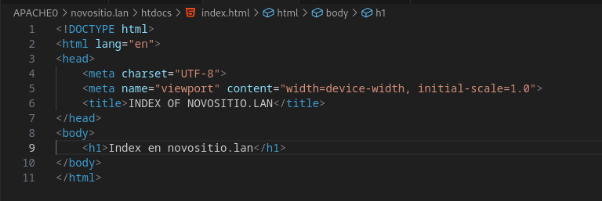

Necesitaremos ter integrado na nosa rede un servidor DNS. (Unha máquina independente con dnsmasq ou o servidor de FreeNom). 

Tomamos unha máquina Ubuntu/Debian na que temos instalado o servidor DNS. Nese servidor DNSfaremos que os rexistros www.novositio.lan e novositio.lan apunten ao enderezo da máquina virtual empregada. (Non necesario se empregamos a máquina de AWS) 

Na configuración para o sitio[ www.novositio.lan](http://www.novositio.lan) debe de ter como directorio raíz de documentos /opt/web/novositio.lan/htdocs, e ter como ficheiros por defecto ao introducir a URL dun directorio a index.html e index.htm. Deberás crear os ficheiros .html de exemplo necesarios. 

**Compose.yml** 

**Compose, aqui habilitamos sss.load o solo ssl.** 

**NOVOSITIO.CONF. Aqui ponemos la configuracion para el nuevo sitio, principalmente todo lo relacionado con ssl.** 

 **LOS FICHEROS NECESARIOS, CERTIFICADOS E** 

**INDEX.HTML** 

**PAGINA INDEX.HTML** 

Crea tamén un certificado autoasinado e habilita outro sitio virtual con https coa mesma configuración que o sitio anterior. 

**CERTIFICADO NOVOSITIO.KEY** 

**CERTIFICADO NOVOSITIO.PEM** 

**ACCESO A INDEX.HTML A TRAVES DE HTTPS** 

**VISTA GENERAL DEL CERTIFICADO DESDE EL NAVEGADOR (CAPTURA DESDE EL PROPIO NAVEGADOR FIREFOX)** 
